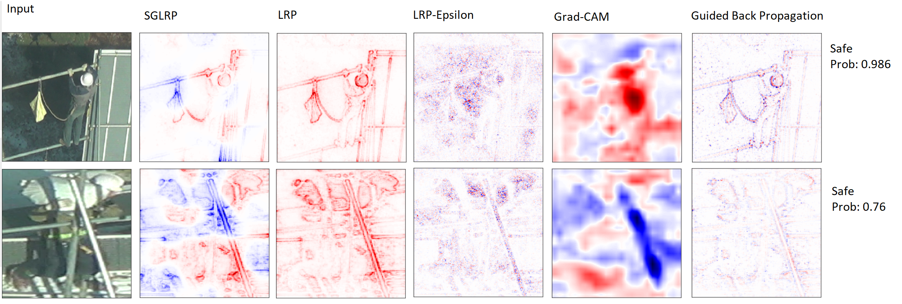
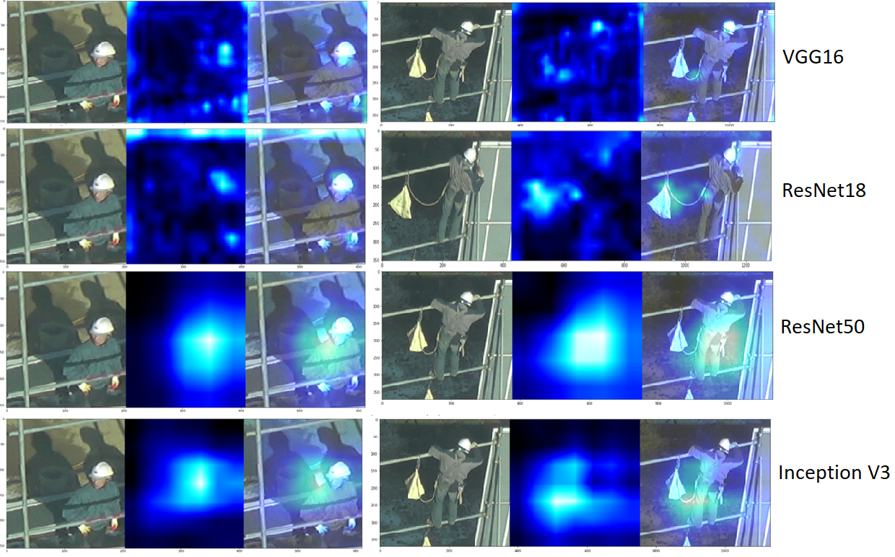

# Anomaly-Detection-at-Construction-Site
Providing various end to end DL approach to solve real life problems at construction site.

These are the predictions and explanation provided by the model

Comparing different Analysis Method 
 

Last Conv layer output from different model

